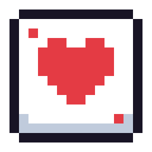

# PokerMachine

### _Video poker cabinet software made in Godot._

 

## What?
In February 2025, I bought a broken, decomissioned video poker machine from a yard sale. After trying to take the preservationist approach, many of the parts were deemed unusable. So, new hardware and software was my answer. The result is Poker Machine, a video poker cabinet software made in Godot.

## Play
Go to [ZombieNW.com/Poker](https://zombienw.com/poker) to Play it Online!